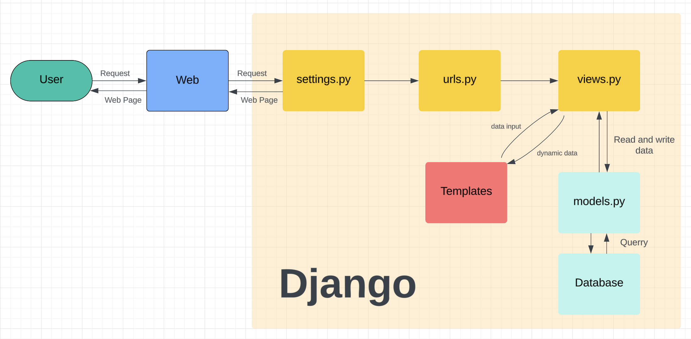

# README
Nama : Ivan Jehuda Angi

NPM : 2306162222

Kelas : PBP E


## Questions
### Jelaskan bagaimana cara kamu mengimplementasikan checklist di atas secara step-by-step (bukan hanya sekadar mengikuti tutorial).

1. Membuat direktori baru dengan nama `ivans-book-store`.

2. Membuat dan mengaktifkan virtual environment pada direktori tersebut dengan:
    ```
        python -m venv env
        env\Scripts\activate
    ```

3. Membuat berkas reqirements berisikan :
    ```
        django
        gunicorn
        whitenoise
        psycopg2-binary
        requests
        urllib3
    ```
    dan menginstal dependencies tersebut dengan perintah `pip install -r requirements.txt`
4. Menginisiasi proyek django baru dengan perintah
`django-admin startproject ivans-book-store .`

5. Membuat aplikasi baru berenama main dengan perintah
`django-admin startproject ivans-book-store .`

6. Membuat berkas template dalam main dan mengisinya dengan 
    ```
        <h1>Ivan's Book Store</h1>
        <h5>NPM: </h5>
        <p>{{ npm }}<p>
        <h5>Name: </h5>
        <p>{{ name }}<p>
        <h5>Class: </h5>
        <p>{{ class }}<p>
    ```
7. Membuat model product dengan memodifikasi berkas models.py dengan 
    ```
    from django.db import models

    class Product(models.Model):
        name = models.CharField(max_length=255)
        price = models.DateField(auto_now_add=True)
        description = models.TextField()
        genre = models.CharField(max_length=255)
    ```
8. Menambahkan routing untuk menghubungkan `views.py` di `main` pada `urls.py`:
        ```python
        from django.urls import path
        from main.views import show_main

        app_name = 'main'

        urlpatterns = [
            path('', show_main, name='show_main'),
        ]
        ```
9. Mengkofigurasi routing url proyeng dengan memodifikasi berkas urls.py dalam direktori ivans_book_store dengan :
    ```
    urlpatterns = [
    ...
    path('', include('main.urls')),
    ...
    ```
10. Melakukan deployment pada PWS (Pacil Web Service).


### Jelaskan bagaimana cara kamu mengimplementasikan checklist di atas secara step-by-step (bukan hanya sekadar mengikuti tutorial).




### Fungsi git dalam pengembangan perangkat lunak
1. Memungkinkan suatu tim mengerjakan suatu proyek secara bersamaan tanpa mengganggu bagian yang lain.

2. Mencatat riwayat perubahan kode serta menyimpan berbagai informasi detail seperti : waktu perubahan dan siapa yang melakukan perubahan.

3. Menjadi tempat penyimpanan file atau product management, memudahkan penggunaan backup file.

4. Memudahkan deployment dengan adanya fungsi pull serta push.


### Alasan Django dijadikan sebagai framewrok pembelajaran
1. Mnyediakan banyak fitur bawaan yang memudahkan pengembangan aplikasi web.
2. Memiliki fitur keamanan yang baik.
3. Memiliki fitur MVT sehingga mengajarkan bagaimana pengembangan web terorganisir.

### Alasan model Django disebut sebagai ORM
 Model pada Django disebut ORM (Object Relational Mapping) karena berfungsi sebagai penghubung antara model (objek) dalam kode Python dengan  database relasional. ORM membantu aplikasi lebih portabel dan mendukung berbagai jenis relasi antar tabel.

