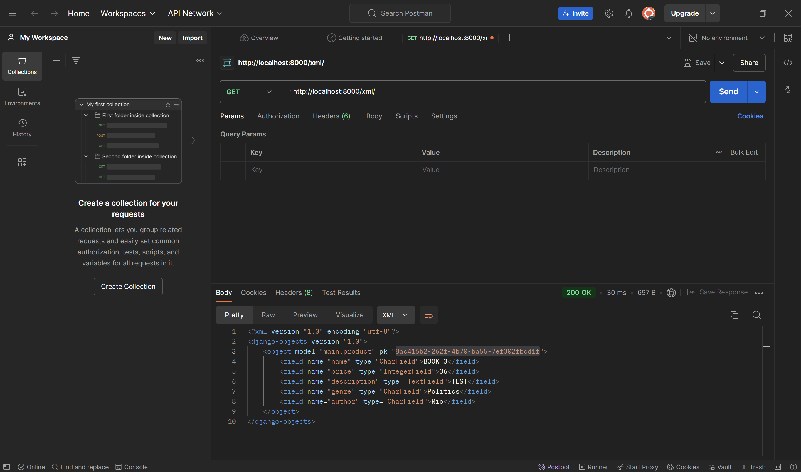
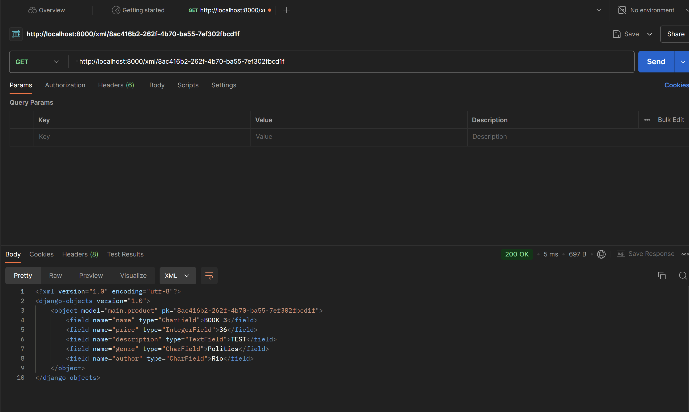
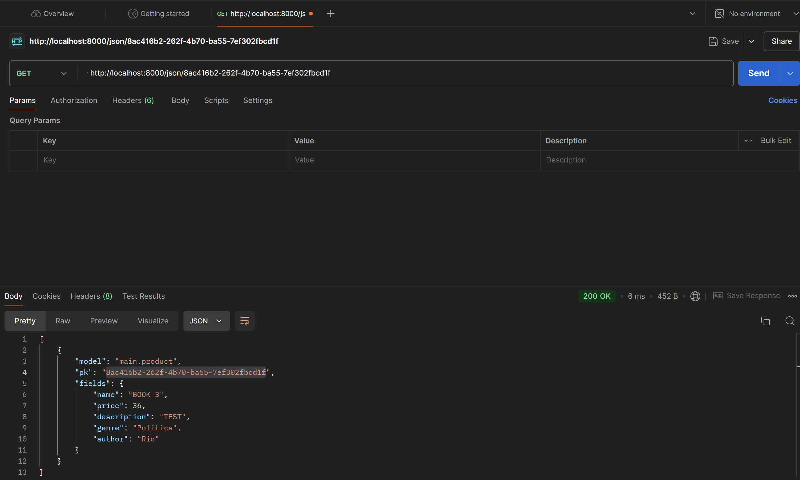

# README
Nama : Ivan Jehuda Angi

NPM : 2306162222

Kelas : PBP E

## Website Link
https://ivan-jehuda-ivansbookstore.pbp.cs.ui.ac.id/

## Questions
### Step by step pembuatan Ivan's Book Store

1. Membuat direktori baru dengan nama `ivans-book-store`.

2. Membuat dan mengaktifkan virtual environment pada direktori tersebut dengan:
    ```
    python -m venv env
    env\Scripts\activate
    ```

3. Membuat berkas reqirements berisikan :
    ```
    django
    gunicorn
    whitenoise
    psycopg2-binary
    requests
    urllib3
    ```
    dan menginstal dependencies tersebut dengan perintah `pip install -r requirements.txt`
4. Menginisiasi proyek django baru dengan perintah
`django-admin startproject ivans-book-store .`

5. Membuat aplikasi baru bernama main dengan perintah :
`python manage.py startapp main`

6. Membuat berkas template dalam main dan mengisinya dengan :
    ```
    <h1>Ivan's Book Store</h1>
    <h5>NPM: </h5>
    <p>{{ npm }}<p>
    <h5>Name: </h5>
    <p>{{ name }}<p>
    <h5>Class: </h5>
    <p>{{ class }}<p>
    ```
7. Membuat model product dengan memodifikasi berkas models.py dengan :
    ```
    from django.db import models

    class Product(models.Model):
        name = models.CharField(max_length=255)
        price = models.DateField(auto_now_add=True)
        description = models.TextField()
        genre = models.CharField(max_length=255)
    ```
8. Menambahkan routing untuk menghubungkan `views.py` di `main` pada `urls.py`:
    ```python
    from django.urls import path
    from main.views import show_main

    app_name = 'main'

    urlpatterns = [ path('', show_main, name='show_main'),]
    ```
9. Mengkofigurasi routing url proyeng dengan memodifikasi berkas urls.py dalam direktori ivans_book_store dengan :
    ```
    urlpatterns = [
    ...
    path('', include('main.urls')),
    ...
    ```
10. Melakukan deployment pada PWS (Pacil Web Service).


### Diagram cara kerja Django


### Fungsi git dalam pengembangan perangkat lunak
1. Memungkinkan suatu tim mengerjakan suatu proyek secara bersamaan tanpa mengganggu bagian yang lain.

2. Mencatat riwayat perubahan kode serta menyimpan berbagai informasi detail seperti : waktu perubahan dan siapa yang melakukan perubahan.

3. Menjadi tempat penyimpanan file atau product management, memudahkan penggunaan backup file.

4. Memudahkan deployment dengan adanya fungsi pull serta push.


### Alasan Django dijadikan sebagai framework pembelajaran
1. Menyediakan banyak fitur bawaan yang memudahkan pengembangan aplikasi web.
2. Memiliki fitur keamanan yang baik.
3. Memiliki fitur MVT sehingga mengajarkan bagaimana pengembangan web terorganisir.

### Alasan model Django disebut sebagai ORM
 Model pada Django disebut ORM (Object Relational Mapping) karena berfungsi sebagai penghubung antara model (objek) dalam kode Python dengan  database relasional. ORM membantu aplikasi lebih portabel dan mendukung berbagai jenis relasi antar tabel.


### Mengapa kita memerlukan data delivery dalam pengimplementasian sebuah platform?
Data sangat penting dalam sebuah platform karena beberapa alasan kunci:

1. **Efisiensi dan Kinerja**: Data yang tepat waktu dan efisien memastikan bahwa pengguna dapat mengakses dan memanfaatkan platform tanpa delay yang signifikan. Ini mempengaruhi kinerja keseluruhan platform, kepuasan pengguna, dan skalabilitas, terutama dalam aplikasi waktu nyata seperti layanan streaming atau komputasi awan.

2. **Pengalaman Pengguna**: Data delivery yang cepat dan dapat diandalkan secara langsung mempengaruhi pengalaman pengguna. Misalnya, di platform e-commerce, pengiriman data yang lambat dapat menyebabkan navigasi yang buruk dan membuat pengguna frustrasi, yang mungkin membuat mereka pergi.

3. **Pengambilan Keputusan Berdasarkan Data**: Banyak platform bergantung pada data delivery secara real-time untuk memberikan wawasan, dasbor, dan analitik yang memungkinkan pengambilan keputusan berdasarkan data. Keterlambatan dalam pengiriman data dapat menyebabkan wawasan yang usang atau tidak akurat.

4. **Keamanan**: Mekanisme data delivery yang efisien memastikan bahwa data sensitif ditransmisikan dengan aman dan mematuhi persyaratan kepatuhan, seperti GDPR atau HIPAA, terutama untuk platform yang menangani data pribadi pengguna.

5. **Kolaborasi dan Integrasi**: Banyak platform perlu mengirimkan data ke sistem lain, API, atau pengguna untuk tujuan integrasi dan kolaborasi. Pengiriman data yang efisien mendukung integrasi yang mulus antara layanan dan memastikan bahwa platform dapat berinteraksi dengan sistem eksternal secara real-time.


## Menurutmu, mana yang lebih baik antara XML dan JSON? Mengapa JSON lebih populer dibandingkan XML?
Menurut saya, dalam hal format pertukaran data yang umum digunakan, saya memilih JSON untuk digunakan. Banyak aspek yang memengaruhi JSON lebih populer dari XML, seperti:

1. **Kesederhanaan**:
   - JSON lebih ringan dan lebih mudah dibaca serta ditulis. Strukturnya lebih sederhana, menggunakan pasangan kunci-nilai.

2. **Keterbacaan**:
   - Format JSON lebih ringkas dan lebih mudah dibaca, terutama bagi para pengembang. Ini terintegrasi secara alami dengan JavaScript, yang menjadikannya ideal untuk aplikasi web.

3. **Kinerja**:
   - JSON memiliki ukuran yang lebih kecil dibandingkan XML karena tidak memiliki tag penutup, sehingga lebih cepat untuk diparse dan ditransmisikan melalui jaringan.

4. **Tipe Data**:
   - JSON mendukung tipe data bawaan seperti angka, string, array, dan boolean, sehingga memudahkan untuk bekerja dengan data secara langsung dalam bahasa pemrograman.

5. **Integrasi dengan JavaScript**:  
   - JSON berasal dari JavaScript, sehingga secara alami kompatibel dengan pengembangan web modern. JavaScript dapat dengan mudah mem-parsing JSON menggunakan `JSON.parse()` dan mengonversi objek menjadi JSON dengan `JSON.stringify()`.

Untuk sebagian besar aplikasi web dan mobile modern, **JSON** lebih baik karena kesederhanaannya, kinerjanya, dan integrasi bawaan dengan JavaScript.


## Fungsi dari method is_valid() pada form Django
Dalam Django, `is_valid()` adalah metode yang digunakan untuk memvalidasi data dalam formulir atau serializer. Ini memeriksa apakah data yang diberikan ke formulir atau serializer memenuhi aturan validasi yang ditetapkan untuk bidang yang sesuai. Metode ini mengembalikan True jika data valid dan False jika tidak. Selain itu, ketika `is_valid()` dipanggil, Django mengisi atribut errors dengan semua kesalahan validasi yang terjadi.

## Step by Step Week 2
1. Membuat berkas `base.html` dan emngisinya dengan
    ```python
    
    <!DOCTYPE html>
    <html lang="en">
        <head>
            <meta charset="UTF-8">
            <meta name="viewport" content="width=device-width, initial-scale=1.0">
             
        </head>
        <body>
             
        </body>
    </html>
    ```

    2. Menambahkan `BASE_DIR` pada `settings.py` agar project mengenali html yang akan menjadi template utama
    ```python
    'DIRS': [BASE_DIR / 'templates'],
    ```

    3. Menambahkan atribut `time` dan `id` pada model product
    ```python
    from django.db import models
    import uuid


    class Product(models.Model):
        id = models.UUIDField(primary_key=True, default=uuid.uuid4, editable=False)  # tambahkan baris ini
        name = models.CharField(max_length=255)
        price = models.IntegerField()
        description = models.TextField()
        genre = models.CharField(max_length=255)
        author = models.CharField(max_length=255, default='-')

    ```

    4. Membuat `forms.py` untuk mendeklarasikan atribut-atribut dari model yang membutuhkan input dari user
    ```python
    from django.forms import ModelForm
    from .models import ProductEntry

    class ProductEntryForm(ModelForm):
        class Meta:
            model = ProductEntry
            fields=['name','price', 'genre', 'description', 'author']
    ```

    5. Membuat method `create_product_entry` untuk mengambil input user sesuai dengan `forms.py`
    ```python
    def create_product_entry(request):
    form = ProductForm(request.POST or None)

    if form.is_valid() and request.method == "POST":
        form.save()
        return redirect('main:show_main')

    context = {'form': form}
    return render(request, "create_product_entry.html", context)
    ```

    6. Membuat method `show_main` untuk menampilkannya di `main.html`
    ```python
    def show_main(request):
    product_entries = Product.objects.all()

    context = {
        'appname' : 'ivans book store',
        'npm' : '2306123456',
        'name': 'Pak Bepe',
        'class': 'PBP E',
        'product_entries': product_entries

    }

    return render(request, "main.html", context)
    ```

    

    8. Membuat `show_xml`, `show_json`, `show_xml_by_id`, `show_json_by_id` untuk menampilkan response back dari input user
    ```python
    def show_xml(request):
        data = ProductEntry.objects.all()
        return HttpResponse(serializers.serialize("xml",data),content_type='application/xml')

    def show_json(request):
        data = ProductEntry.objects.all()
        return HttpResponse(serializers.serialize("json",data),content_type='application/json')

    def show_xml_by_id(request, id):
        data = ProductEntry.objects.filter(pk=id)
        return HttpResponse(serializers.serialize("xml", data), content_type="application/xml")

    def show_json_by_id(request, id):
        data = ProductEntry.objects.filter(pk=id)
        return HttpResponse(serializers.serialize("json", data), content_type="application/json")
    ```

    9. Melakukan routing di dari method yang sudah dibuat di `urls.py`
    ```python
    from django.urls import path
    from main.views import show_main,create_name_entry,show_xml,show_json,show_xml_by_id,show_json_by_id,delete_product_entry

    app_name = 'main'

    urlpatterns = [
        path('', show_main, name='show_main'),
        path('create-name-entry', create_name_entry, name='create_name_entry'),
        path('xml/',show_xml,name='show_xml'),
        path('json/',show_json,name='show_json'),
        path('xml/<str:id>/', show_xml_by_id, name='show_xml_by_id'),
        path('json/<str:id>/', show_json_by_id, name='show_json_by_id'),
        ]
    ```

    10. Membuat `create_product_entry.html` untuk tampilan ketika web ingin meminta input dari pengguna
    ```python
     
    
    <h1>Add New Product Entry</h1>

    <form method="POST">
    
    <table>
        {{ form.as_table }}
        <tr>
        <td></td>
        <td>
            <input type="submit" value="Add Product " />
        </td>
        </tr>
    </table>
    </form>

    
    ```
    
    11. Membuat `main.html` untuk menampilkan product dari hasil input pengguna
    ```python
        
        
        <h1>Ivan's Book Store</h1>

        <h5>NPM: </h5>
        <p>{{ npm }}<p>

        <h5>Name:</h5>
        <p>{{ name }}</p>

        <h5>Class:</h5>
        <p>{{ class }}</p>
        
        <p>Belum ada data produk pada ivan's book store.</p>
        
        <table>
        <tr>
            <th>Product Name</th>
            <th>Price</th>
            <th>Genre</th>
            <th>Description</th>
            <th>Author</th>
        </tr>

         Berikut cara memperlihatkan data prduk di bawah baris ini 
         
        
        <tr>
            <td>{{product_entry.name}}</td>
            <td>{{product_entry.price}}</td>
            <td>{{product_entry.genre}}</td>
            <td>{{product_entry.description}}</td>
            <td>{{product_entry.author}}</td>
        </tr>
        
        </table>
        

        <br />

        <a href="">
        <button>Add New Product Entry</button>
        </a>
        
    ```
## Pentingnya crsf_TOKEN dan bahaya penyerang
Token Cross-Site Request Forgery melindungi aplikasi dari serangan Cross-Site Request Forgery. Dengan memiliki csrf_token, mereka dapat memastikan bahwa request POST berasal dari situs yang sah dan mencegah modifikasi data yang tidak sah melalui request palsu. Tanpa csrf_token, penyerang dapat membuat request palsu menggunakan nama pengguna yang sudah terotentikasi, mengubah data sensitif, atau mengakses informasi pribadi pengguna.

Jika csrf_token tidak ada, penyerang akan membuat situs web berbahaya atau memodifikasi situs web yang sudah ada. Saat pengguna masuk ke aplikasi Django, mereka akan tanpa disadari mengakses situs berbahaya tersebut. Selanjutnya, situs berbahaya akan memuat form tersembunyi yang meminta aplikasi Django.


# Postman Screenshots
## a.  XML


## b. JSON


## c. XML by id


## d. JSON by id

